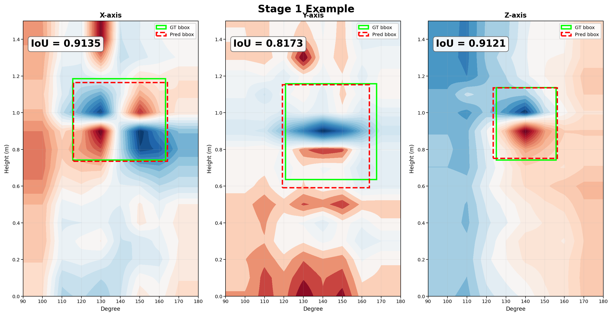
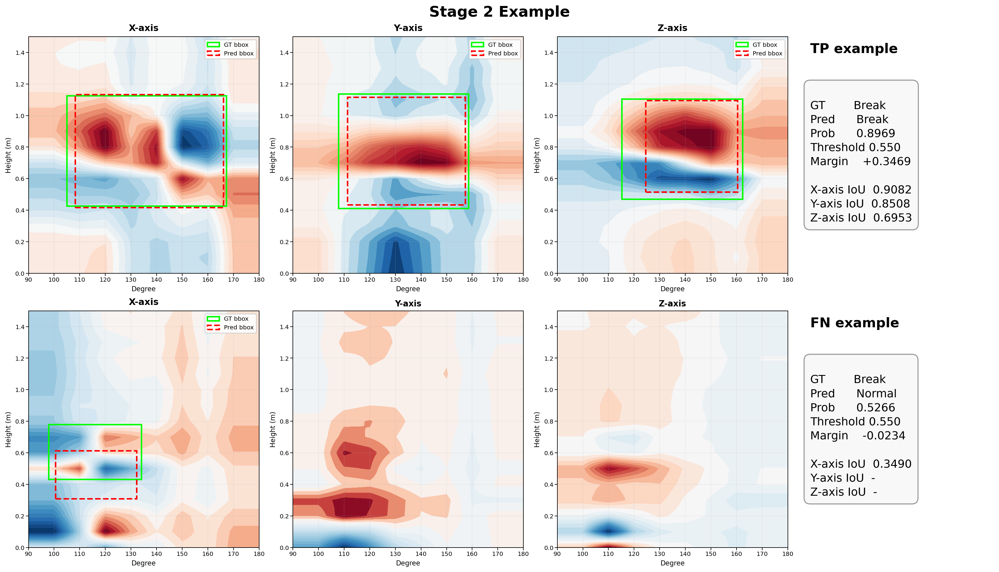

# 파단 패턴 학습 파이프라인

이 프로젝트의 목적은 전주 측정 데이터를 2D 패턴 이미지로 변환한 뒤, 그 안에서 **파단이 나타나는 위치적 특징을 먼저 학습하고**, 그 특징을 바탕으로 **최종적으로 Break / Normal을 판별하는 모델**을 만드는 것입니다.

전주 측정 데이터는 **자기장 기반의 x, y, z 3축 센서값**으로 구성됩니다. 즉, 하나의 샘플은 단순한 이미지가 아니라, 전주의 높이와 각도 방향에 따라 측정된 **3축 자기장 변화 패턴**을 담고 있는 데이터입니다.

모델 학습은 두 단계로 나누어 구성했습니다. 처음부터 Break / Normal만 바로 분류하게 하면 모델이 무엇을 근거로 판단해야 하는지 불안정해질 수 있습니다. 그래서 먼저 모델이 **파단이 어디에 어떻게 나타나는지**를 배우게 하고, 그 다음에 그 특징을 이용해 **최종 판단**을 하도록 구성했습니다.

---

## 전체 흐름

전체 파이프라인은 학습 데이터 생성 단계와 두 단계의 모델 학습 단계로 구성됩니다.

### 1. 학습 데이터 생성
원본 측정 CSV와 사람이 직접 의심되는 파단 구역을 설정한 ROI 정보를 이용해, 모델이 바로 사용할 수 있는 학습용 배열(`.npy`)을 만드는 단계입니다.

원본 CSV에는 전주의 **높이(height)**, **각도(degree)**, 그리고 각 위치에서 측정된 **x_value, y_value, z_value**가 들어 있습니다.  
이 값들은 전주 표면을 따라 측정된 3축 자기장 정보입니다.

이 단계에서는 `4. merge_data` 폴더에 있는 측정 CSV를 읽고, `9. edit_data` 폴더에 있는 파단 의심 구역 정보를 함께 사용해 학습용 입력과 라벨을 생성합니다. 특히 실제 파단 데이터에 대해서는 **x, y, z 각 축별 ROI 영역**을 바탕으로 파단 의심 구역의 bbox를 라벨로 구성합니다.

최종적으로 생성되는 입력 데이터는 `5. train_data` 폴더 아래에 `.npy` 형태로 저장되며, 모델 입력 이미지는 표준화된 형태인 `304 × 19 × 3` 형태를 사용합니다.
여기서 마지막 차원 `3`은 각각 **x, y, z 축 센서값 채널**을 의미합니다. 
즉 하나의 샘플은 높이축과 각도축 위에 정렬된 **3채널 자기장 패턴 이미지**입니다.  

라벨은 하나의 1차원 벡터로 저장됩니다. 맨 앞 1칸은 클래스 레이블(0: 정상, 1: 파단)이고, 그 뒤에는 x, y, z 축 순서의 bbox 정보와 각 bbox 슬롯의 유효 여부를 나타내는 mask 값이 저장됩니다. 각 축마다 최대 K개의 bbox를 가질 수 있으며, mask가 1이면 유효한 bbox, 0이면 패딩된 빈 슬롯을 의미합니다.

즉, 이 단계는 **원본 측정 데이터를 모델이 학습할 수 있는 2D 패턴 표현으로 변환하고, 파단 위치 정보를 함께 정리하는 준비 단계**입니다.

- 관련 파일: `6. training_data_bbox_extracted.py`

---

## 모델 학습 구조

전체 구조는 다음과 같습니다.

- **1차 학습**: 파단 위치와 패턴 특징 학습
- **2차 학습**: 축별 특징을 결합해 Break / Normal 최종 판별

---

## 1차 학습: 위치 특징 학습

이 단계의 목적은 **파단 여부를 바로 분류하는 것**이 아니라,
입력 패턴 안에서 **파단과 관련된 위치적 특징을 먼저 학습하는 것**입니다.

모델은 하나가 아니라 **x / y / z 축별로 각각 따로 학습**됩니다.
즉, 각 축마다 독립적인 네트워크가 하나씩 존재하며,
각 네트워크는 자신이 담당하는 축에서 **파단 후보 영역의 위치와 크기**를 예측하도록 학습됩니다.

이때 하나의 축에 대해 여러 개의 ROI가 존재할 수 있으므로,
라벨에는 축별로 최대 `K`개의 bbox가 저장됩니다.

여러 ROI와 bbox 중, 현재 학습 방식은 **예측 bbox와 정답 bbox의 모든 조합을 비교한 뒤, 가장 잘 맞는 대표적인 한 쌍(best pair)을 중심으로 학습**이 이루어집니다.

정리하면, 이 단계는 **“파단이 어디에 어떻게 나타나는가”를 먼저 배우는 단계**이며, 또한 confidence 출력 구조는 포함되어 있지만, 현재 설정에서는 **실질적으로 bbox 위치 학습이 중심**이며, confidence 항은 주요 학습 목표로 적극 활용하지 않는 설정입니다.

- 관련 파일: `7. train_break_pattern_resnet_bbox_confidence.py`

### 1차 학습 결과
1차 학습이 끝나면 축별 최적 가중치가 저장됩니다.

- `best_x.keras`
- `best_y.keras`
- `best_z.keras`

현재 사용 중인 최종 가중치는 이후 2차 학습에서 feature extractor의 초기 기반으로 사용됩니다.

### 1차 테스트 성과
테스트 데이터(`X_test: 459개`) 기준, 1차 학습 모델의 **Mean Best-IoU**는 다음과 같습니다.

- **X 축**: **0.8068**
- **Y 축**: **0.7392**
- **Z 축**: **0.7982**

여기서 **Mean Best-IoU**는 각 샘플에서 **예측 bbox들과 정답 bbox들 사이의 IoU를 모두 계산한 뒤, 가장 크게 매칭되는 값 하나(best pair)를 고르고**, 그 값을 전체 테스트 샘플에 대해 평균낸 지표입니다.

결과적으로 X 축에서 가장 높은 위치 정합도를 보였고, Y 축과 Z 축도 비교적 비슷한 수준의 성능을 보였습니다. 즉, 1차 학습 모델은 세 축 모두에서 **파단 의심 위치를 일관되게 찾아내고 있습니다.**

#### 1차 학습 대표 예시

위 그림은 1차 학습에서 x, y, z 각 축별로 **파단 의심 위치의 bbox를 예측한 결과**를 보여줍니다. 
초록색 박스는 정답 bbox(GT), 빨간 점선 박스는 모델이 예측한 bbox(Pred)입니다. 
세 축 모두에서 예측 bbox가 정답 bbox와 유사한 위치에 형성되는 것을 확인할 수 있으며, 이는 1차 학습 모델이 파단 위치를 비교적 안정적으로 찾아내고 있음을 보여줍니다.

---

## 2차 학습: 최종 판별 학습

2차 학습의 목적은 1차 학습에서 얻은 축별 특징을 이용해, 입력 샘플이 **Break인지 Normal인지 최종 판별**하는 것입니다.

이 단계에서는 1차 학습에서 저장한 `best_x.keras`, `best_y.keras`, `best_z.keras`를 다시 bbox 예측용 출력으로 사용하는 것이 아니라, 각 모델에서 형성된 **특징 표현(feature representation)**을 가져와 파단여부를 분류하는 2차 분류 모델의 초기 기반으로 사용합니다.

즉, 1차 학습이 **파단 위치와 패턴에 대한 특징을 학습**하는 단계라면, 2차 학습은 그 특징을 바탕으로 **최종 Break / Normal 이진 분류를 수행하는 단계**입니다.

2차 학습에서는 x / y / z 축에서 추출된 feature를 결합하고, 샘플별로 각 축의 중요도를 반영하는 gate 구조를 거쳐 최종적으로 하나의 **binary classifier**를 학습합니다.

또한 2차 학습은 한 번에 끝나는 구조가 아니라 두 단계로 진행됩니다. 먼저 초기 단계에서는 축별 특징 추출기를 고정한 상태에서 분류기 head를 중심으로 학습하고, 그 다음 단계에서는 특징 추출기의 일부 후반부 레이어를 다시 열어 최종 분류 목적에 맞게 **fine-tuning**합니다.

- 관련 파일: `8. train_break_pattern_resnet_binary_from_bbox.py`

### 2차 학습 결과
2차 학습의 최종 결과물은 **Break / Normal을 판별하는 통합 이진 분류 모델**입니다.

최종 모델 가중치 파일은 축별 특징을 결합한 **최종 분류 모델 **인 `final_binary.keras`입니다.

### 2차 테스트 성과
2차 테스트 결과는 다음과 같습니다.

- **Precision (class 1)**: **0.8333**
- **Recall (class 1)**: **0.9524**

즉, 현재 2차 분류 모델은 **파단 샘플을 높은 recall로 놓치지 않으면서도**, precision 역시 비교적 안정적으로 유지하고 있습니다. 특히 실제 파단 샘플을 최대한 놓치지 않는 방향에서 좋은 성능을 보이고 있으며, 이 모델은 **파단 의심 샘플을 우선적으로 선별하고 검토를 보조하는 도구**로 활용하기에 충분합니다.

#### 2차 학습 대표 예시

2차 학습에서는 축별 특징을 결합해 최종적으로 Break / Normal을 판별합니다. 위 요약 박스는 대표적인 TP와 FN 사례를 보여줍니다.

- **TP example**: 실제 Break 샘플을 Break로 올바르게 판별한 사례입니다. 세 축 모두에서 bbox 정합도가 비교적 높게 나타났고, 최종 예측 확률도 threshold(0.550)를 충분히 넘어 안정적으로 Break로 분류되었습니다.

- **FN example**: 실제 라벨은 Break이지만 최종적으로 Normal로 분류된 사례입니다. 이 샘플은 **x축에만 유효한 bbox가 존재하고, y축과 z축에는 유효한 bbox가 없습니다.** 즉, 파단 위치에 대한 명시적인 정답 신호가 x축에만 존재하는 샘플이며, 다른 축에서는 이를 보조할 수 있는 위치 라벨이 부족한 상태였습니다. 
그 결과 최종 확률이 threshold를 약간 넘지 못해 FN으로 분류되었습니다.

---

## 데이터가 어떻게 쓰이는가

이 프로젝트에서 학습에 직접 쓰이는 입력은 최종적으로 `5. train_data`에 저장된 `.npy` 데이터입니다. 이 데이터는 원본 측정 CSV를 그대로 사용하는 것이 아니라, 전처리와 ROI 정보 반영을 거친 뒤 만들어집니다.

데이터 흐름은 다음과 같습니다.

- **원본 측정 데이터 (`4. merge_data`)**  
  각 샘플은 전주 표면에서 측정된 값을 정리한 CSV 파일이며, 기본적으로 `height`, `degree`, `x_value`, `y_value`, `z_value`, `devicetype` 정보를 포함합니다. 여기서 `height`와 `degree`는 위치 정보이고, `x_value`, `y_value`, `z_value`는 해당 위치에서 측정된 3축 자기장 센서값입니다.

- **ROI 및 편집 정보 (`9. edit_data`)**  
  이 데이터는 파단 의심 구역을 사람이 직접 지정한 ROI 정보입니다. JSON 파일에는 축별 ROI가 저장되며, 각 ROI는 `degree_min`, `degree_max`, `height_min`, `height_max` 형태의 bbox 범위를 가집니다. 즉, edit_data의 JSON은 **파단 의심 위치의 범위 정보**를 담고 있습니다.

- **학습용 배열 (`5. train_data`)**  
  위 두 정보를 바탕으로 최종 학습용 `.npy`가 생성됩니다. 입력 이미지는 `304 × 19 × 3` 형태의 배열로 저장되며, 마지막 채널 `3`은 각각 x, y, z 축 센서 패턴을 의미합니다.  

  라벨에는 다음 정보가 함께 저장됩니다.
  - **클래스 레이블**: 정상(`0`) / 파단(`1`)
  - **축별 bbox 정보**: x, y, z 축 각각에 대해 최대 `K`개의 bbox
  - **mask 정보**: 각 bbox 슬롯이 실제 ROI인지, 패딩인지 구분하는 값

즉, 학습용 라벨은 분류 정보와 위치 정보를 함께 담도록 구성됩니다.